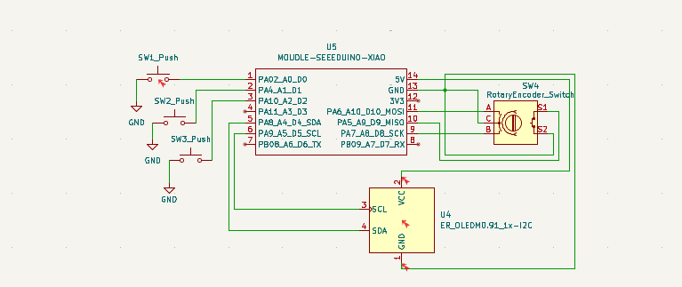

Hakin Pad™

A small custom macropad designed from scratch with KiCad.

Hakin Pad™ \n
Designed on a screen. 
Built on a desk. 
A few commands. 
A lot of buttons. And 
Some productive copper too. 

Hakin Pad™ is my second hardware project and my first time properly taking a keyboard-style PCB through the full design process. The goal is to build a simple, useful pad with physical buttons, a rotary encoder, and a small OLED display, while keeping the design compact and easy to understand.

What I'm Building

The current design includes:

XIAO RP2040 as the main controller
Multiple physical buttons
Rotary encoder with push function
0.91" I2C OLED display
Custom PCB
Custom 3D-printed case
Custom firmware

The board is being designed specifically for this project rather than using an existing macropad design.

Current Progress

The schematic is currently being developed in KiCad. I've already connected the main components and started preparing the design for the PCB stage.

I'm also experimenting with a larger number of buttons instead of stopping at the initial three-button setup.

The next major steps are:

Finish footprint selection
Move the design into PCB Editor
Arrange the components
Design the PCB outline
Route the board
Run ERC and DRC
Design the case
Write the firmware
Test and revise the design
Prepare the final production files
Why Hakin Pad?

I wanted to make something physical instead of another purely software-based project.

The idea is simple:

Designed on a screen.
Built on a desk.
A few commands.
A lot of buttons.
Some productive copper too.

Tools
KiCad
XIAO RP2040
QMK / custom firmware work
3D printing
GitHub
Project Status

In development

This repository will contain the PCB, CAD, firmware, and production files as the project progresses.

More work coming soon.
