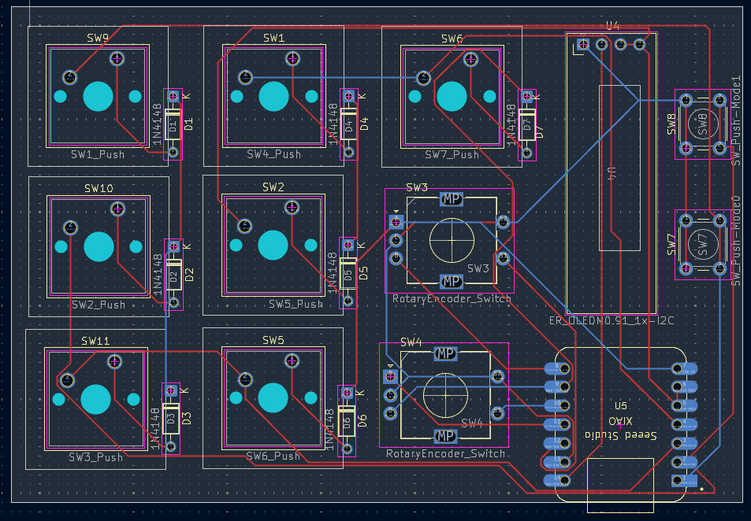

## Hakin Pad™
[**README & the WHOLE build is indeed whole done by me(Yousuf) only and the AI used is as per regulations are mentioned in the project description.**]
A small custom macropad designed from scratch with KiCad.

--
Hakin Pad™
Designed on a screen.
Built on a desk.
A few commands.
A lot of buttons. And
Some productive copper too.
--

# Hakin Pad™

 Designed on a screen.  
 Built on a desk.

Hakin Pad™ is my second hardware project and my first custom macropad, designed from scratch in KiCad.

It features a XIAO RP2040, physical keys, two rotary encoders, a 0.91" I2C OLED, a custom PCB, and a custom 3D-printed case.

## Features

- XIAO RP2040
- 7 physical keys
- 2 rotary encoders with push switches
- 0.91" I2C OLED display
- Custom PCB designed in KiCad
- Custom 3D-printed case
- Custom firmware

## Files

- `PCB/` — KiCad schematic, PCB and fabrication files
- `CAD/` — 3D case files
- `Firmware/` — firmware
- `production/` — production files
- `Screenshots/` — project images

## Tools

- KiCad
- FreeCAD
- CircuitPython / KMK
- Git & GitHub

## Status

**Design complete — ready for production.**

This project was designed and documented by me, Yousuf. AI assistance was used only where permitted by the project/program rules.
